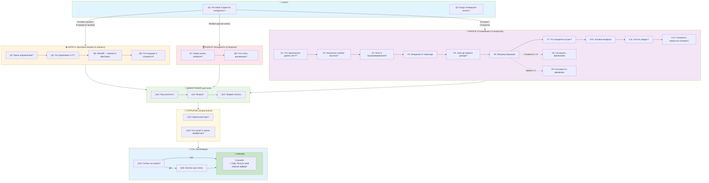

# Финальный План Опроса Аудитории Kata Academy

**Дата создания:** 20 января 2026
**Статус:** Готов к пилотному запуску
**Основа:** Результаты Круглого Стола (Head of Marketing, CRM Lead, Sales Director)

---

## 📋 Общая Информация

| Параметр | Значение |
|----------|----------|
| **Тип исследования** | Количественный онлайн-опрос |
| **Цель** | Изучение аудитории, выявление барьеров, отбор на интервью |
| **НЕ цель** | Продажа или реклама услуг |
| **Целевое время прохождения** | 4-5 минут |
| **Целевой Completion Rate** | >60% |
| **Целевая конверсия в интервью** | 15-20% |
| **Аудитория** | Не купившие курс (лиды из базы) |

---

## 🗺 Карта Опроса (Логика Ветвления)



---

## 🎁 Лид-Магниты

### За прохождение опроса (всем):
**«Получи свой первый оффер!»**
- Практический гайд по получению первого Job Offer в IT
- Автоматическая отправка сразу после завершения опроса

### За участие в интервью (дополнительно):
**«ТОП-10 языков программирования в 2026 году»**
- Аналитический обзор: зарплаты, вакансии, перспективы
- PDF с инфографикой
- Отправляется после проведения интервью

---

## 📊 ЕДИНЫЙ ОПРОСНИК

**Отправка:** Email-рассылка по базе лидов, не совершивших покупку
**Длина:** 12-14 вопросов, 4-5 минут

---

### БЛОК 1: Скрининг (2 вопроса)

#### Q1. На какой стадии принятия решения об обучении IT вы сейчас находитесь?
*Тип: Одиночный выбор*

- [ ] Активно изучаю рынок и сравниваю курсы
- [ ] В процессе выбора, но пока не определился
- [ ] Выбрал другую школу и уже учусь/записался
- [ ] Решил отложить обучение на неопределенный срок
- [ ] Полностью отказался от идеи обучения в IT

> **Логика ветвления:**
> - "Активно изучаю" / "В процессе выбора" → Блок 2А (Критерии выбора)
> - "Выбрал другую школу" → Блок 2Б (Конкуренты)
> - "Отложил" / "Отказался" → Блок 2В (Причины отказа)

---

#### Q2. Когда вы планируете начать обучение?
*Тип: Одиночный выбор*

- [ ] В ближайший месяц
- [ ] Через 2-3 месяца
- [ ] Через полгода или позже
- [ ] Пока не планирую

---

### БЛОК 2А: Критерии Выбора (для активно выбирающих)

#### Q3. Какое направление обучения вас интересует?
*Тип: Множественный выбор*

- [ ] Java-разработка
- [ ] Frontend-разработка
- [ ] Go-разработка
- [ ] QA / Тестирование
- [ ] 1C-разработка
- [ ] Другое (укажите): ________

---

#### Q4. Что привлекает вас в IT-сфере?
*Тип: Множественный выбор (макс. 3 варианта)*

- [ ] Высокий уровень зарплат
- [ ] Возможность работать удаленно
- [ ] Востребованность профессии на рынке
- [ ] Интерес к технологиям и программированию
- [ ] Желание сменить текущую профессию
- [ ] Гибкий график работы
- [ ] Возможности карьерного роста
- [ ] Другое: ________

---

#### Q5. Оцените важность следующих факторов при выборе курса
*Тип: MaxDiff (из 5 атрибутов выбрать "Самый важный" и "Наименее важный")*

**Набор 1:**
| Атрибут | Самый важный | Наименее важный |
|---------|--------------|-----------------|
| Гарантия трудоустройства | ○ | ○ |
| Практикующие менторы из индустрии | ○ | ○ |
| Стоимость обучения | ○ | ○ |
| Отзывы и репутация школы | ○ | ○ |
| Гибкий график обучения | ○ | ○ |

**Набор 2:**
| Атрибут | Самый важный | Наименее важный |
|---------|--------------|-----------------|
| Помощь с резюме и подготовка к собеседованиям | ○ | ○ |
| Много практики и реальных проектов | ○ | ○ |
| Понятное объяснение материала | ○ | ○ |
| Возможность рассрочки/отложенной оплаты | ○ | ○ |
| Активное сообщество студентов | ○ | ○ |

---

#### Q6. Что больше всего смущает в стоимости курсов?
*Тип: Одиночный выбор*

- [ ] Абсолютная сумма слишком высокая
- [ ] Не понимаю, что входит в стоимость
- [ ] Не уверен в окупаемости вложений
- [ ] Нет подходящего формата оплаты (рассрочка, отложенный платеж)
- [ ] Стоимость меня не смущает

---

### БЛОК 2Б: Конкуренты (для выбравших другую школу)

#### Q7. Какую школу/курс вы выбрали?
*Тип: Одиночный выбор с полем "Другое"*

- [ ] Skillbox
- [ ] GeekBrains
- [ ] Яндекс Практикум
- [ ] Skypro
- [ ] Нетология
- [ ] Hexlet
- [ ] Самостоятельное обучение (бесплатные ресурсы)
- [ ] Другое: ________

---

#### Q8. Что стало решающим фактором в пользу этого выбора?
*Тип: Множественный выбор (макс. 3 варианта)*

- [ ] Более низкая цена
- [ ] Удобные условия оплаты
- [ ] Лучшие отзывы в интернете
- [ ] Рекомендация друзей/знакомых
- [ ] Более сильная гарантия трудоустройства
- [ ] Известность бренда
- [ ] Понравились бесплатные материалы/пробный доступ
- [ ] Другое: ________

---

### БЛОК 2В: Отложившие/Отказавшиеся (РАСШИРЕННЫЙ — 12 вопросов)

> [!IMPORTANT]
> Это основной сегмент аудитории (60-70% базы). Блок расширен по итогам дополнительного Круглого Стола для глубокого понимания мотивации, барьеров и условий возврата.

---

#### V1. Что изначально подтолкнуло вас задуматься о смене профессии на IT?
*Тип: Множественный выбор*

- [ ] Недовольство текущей работой/зарплатой
- [ ] Увидел успешные примеры перехода (друзья, знакомые)
- [ ] Интерес к технологиям с детства/молодости
- [ ] Сокращение/потеря работы
- [ ] Желание работать удаленно
- [ ] Возможности для переезда/релокации
- [ ] Мода на IT-профессии
- [ ] Другое: ________

---

#### V2. Насколько глубоко вы изучали тему IT-обучения?
*Тип: Одиночный выбор*

- [ ] Просто видел рекламу / слышал от знакомых
- [ ] Читал статьи, смотрел видео по теме
- [ ] Сравнивал несколько школ/курсов
- [ ] Проходил бесплатные уроки или вебинары
- [ ] Уже пытался учиться самостоятельно

---

#### V3. Есть ли у вас какой-либо опыт в программировании?
*Тип: Одиночный выбор*

- [ ] Нет, совсем нулевой
- [ ] Изучал в школе/университете, но давно забыл
- [ ] Проходил бесплатные курсы (Codecademy, YouTube, и т.д.)
- [ ] Пробовал писать код самостоятельно (скрипты, простые программы)
- [ ] Работал/работаю в смежной области (аналитика, админство, 1С)

---

#### V4. Какой результат вы ожидаете от перехода в IT?
*Тип: Множественный выбор (макс. 3 варианта)*

- [ ] Зарплата от 80 000 ₽
- [ ] Зарплата от 120 000 ₽
- [ ] Зарплата от 180 000 ₽+
- [ ] Возможность работать полностью удаленно
- [ ] Гибкий график работы
- [ ] Интересная, творческая работа
- [ ] Стабильность и востребованность
- [ ] Возможность переехать в другую страну
- [ ] Уважение и статус профессии

---

#### V5. Как скоро вы ожидаете выйти на первый доход в IT после начала обучения?
*Тип: Одиночный выбор (опционально)*

- [ ] 3-4 месяца
- [ ] 6 месяцев
- [ ] 9-12 месяцев
- [ ] Более года
- [ ] Не знаю / не задумывался

---

#### V6. Что повлияло на ваше решение отложить или отказаться от обучения?
*Тип: Матрица влияния (4-балльная шкала)*

Оцените влияние каждого фактора:
1 = Не повлияло | 2 = Слабо | 3 = Умеренно | 4 = Сильно повлияло

| Фактор | 1 | 2 | 3 | 4 |
|--------|---|---|---|---|
| Высокая стоимость обучения | ○ | ○ | ○ | ○ |
| Неуверенность в своих силах | ○ | ○ | ○ | ○ |
| Нехватка свободного времени | ○ | ○ | ○ | ○ |
| Сомнения в качестве курсов | ○ | ○ | ○ | ○ |
| Негативные отзывы в интернете | ○ | ○ | ○ | ○ |
| Изменение жизненных обстоятельств | ○ | ○ | ○ | ○ |
| Страх, что не найду работу после обучения | ○ | ○ | ○ | ○ |
| Рынок IT перенасыщен джунами | ○ | ○ | ○ | ○ |
| Нашел альтернативный путь в IT | ○ | ○ | ○ | ○ |

---

#### V7. Что конкретно вас пугает в начале обучения?
*Тип: Множественный выбор*

- [ ] Боюсь не справиться с программой
- [ ] Боюсь потратить деньги впустую
- [ ] Боюсь потратить время и не получить результат
- [ ] Не уверен, что IT — это для меня
- [ ] Боюсь, что возраст помешает трудоустройству
- [ ] Боюсь, что без технического образования будет сложно
- [ ] Боюсь конкуренции с молодыми специалистами
- [ ] Боюсь, что рынок IT перенасыщен начинающими
- [ ] Ничего конкретного — просто общее сомнение

---

#### V8. Что касается ФИНАНСОВ — какая ситуация ближе к вашей?
*Тип: Одиночный выбор*
*(Показывается, если в V6 отметили "Стоимость" на 3 или 4)*

- [ ] Могу оплатить полную стоимость, но не уверен в ценности
- [ ] Есть деньги на рассрочку, но сомневаюсь в результате
- [ ] Сейчас нет денег, но планирую накопить
- [ ] Принципиально не готов платить до результата (ищу ISA/постоплату)
- [ ] Финансовый вопрос не главный барьер

---

#### V9. Что касается ВРЕМЕНИ — какая ситуация ближе к вашей?
*Тип: Одиночный выбор*
*(Показывается, если в V6 отметили "Время" на 3 или 4)*

- [ ] Работаю полный день, вечера заняты семьей/обязанностями
- [ ] Работаю полный день, но вечера свободны
- [ ] Работаю частично, есть время на обучение
- [ ] Не работаю, но много других обязанностей (дети, уход за близкими)
- [ ] Не работаю, время на обучение есть

---

#### V10. При каких условиях вы бы вернулись к идее обучения?
*Тип: Множественный выбор*

- [ ] Появится больше свободного времени
- [ ] Улучшится финансовая ситуация
- [ ] Найду курс с гарантией результата (трудоустройство или возврат денег)
- [ ] Получу подтверждение, что IT — это мое (проф.тест, консультация)
- [ ] Найду формат под свой график (например, выходные)
- [ ] Дети подрастут / изменятся семейные обстоятельства
- [ ] Не планирую возвращаться к этой идее

---

#### V11. Кто или что могло бы убедить вас начать обучение?
*Тип: Множественный выбор*

- [ ] Личный пример друга/знакомого, который успешно перешел в IT
- [ ] Гарантия возврата денег, если не устроюсь на работу
- [ ] Пробный доступ / бесплатный модуль курса
- [ ] Разговор с реальным выпускником курса
- [ ] Консультация с карьерным специалистом
- [ ] Реальные отзывы на независимых площадках
- [ ] Снижение цены / специальное предложение
- [ ] Ничего — я окончательно отказался от идеи

---

#### V12. Как бы вы оценили свою готовность вернуться к обучению IT в будущем?
*Тип: Одиночный выбор*
*(Используется для скоринга лидов)*

- [ ] Точно вернусь при подходящих условиях
- [ ] Скорее вернусь, если что-то изменится
- [ ] 50/50 — не уверен
- [ ] Скорее не вернусь
- [ ] Точно не вернусь — это не для меня

> **Скоринг для CRM:**
> - "Точно/Скорее вернусь" = 🔥 Горячие — работаем активно
> - "50/50" = 🟡 Нейтральные — контентный nurturing
> - "Скорее/Точно не" = ❄️ Холодные — можно архивировать

---

### БЛОК 3: Демография и Контекст (для всех)

#### Q10. Ваш текущий род занятости
*Тип: Одиночный выбор*

- [ ] Работаю полный день (офис/удаленно)
- [ ] Работаю частичную занятость
- [ ] Фрилансер / Самозанятый
- [ ] В поиске работы
- [ ] Студент / Учусь
- [ ] Декретный отпуск
- [ ] Не работаю по другим причинам

---

#### Q11. Ваш возраст
*Тип: Одиночный выбор*

- [ ] 18-24
- [ ] 25-29
- [ ] 30-34
- [ ] 35-39
- [ ] 40+

---

#### Q12. Какой формат оплаты для вас предпочтительнее?
*Тип: Одиночный выбор*

- [ ] Единоразовая полная оплата (с максимальной скидкой)
- [ ] Рассрочка от банка на 6-12 месяцев
- [ ] Рассрочка от школы без переплат
- [ ] Отложенная оплата после трудоустройства (ISA)
- [ ] Затрудняюсь ответить

---

### БЛОК 4: Открытые Вопросы (опциональные)

#### Q13. Если бы идеальный курс программирования существовал, как бы он выглядел?
*Тип: Открытый (необязательный)*
*Подсказка: Опишите формат обучения, поддержку, результаты — всё, что для вас важно*

```
[Текстовое поле — 500 символов]
```

---

#### Q14. Что вас больше всего пугает или останавливает в идее смены профессии на IT?
*Тип: Открытый (необязательный)*

```
[Текстовое поле — 300 символов]
```

---

### БЛОК 5: Приглашение на Интервью

#### Q15. Готовы ли вы поделиться своим мнением в коротком созвоне?
*Тип: Одиночный выбор*

> Мы хотим сделать обучение в IT лучше. Это займет не более 10 минут. Мы ничего не продаем — только слушаем. 
>
> 🎁 **В благодарность вы получите:** гайд «ТОП-10 языков программирования в 2026 году» — аналитика по зарплатам, вакансиям и перспективам каждого языка.

- [ ] Да, готов(а) пообщаться — свяжитесь со мной
- [ ] Нет, только опрос

---

#### Q16. Как с вами связаться? (если выбрали "Да")
*Тип: Открытый (условный — появляется только при "Да")*

- Предпочтительный канал связи: [ ] Телефон [ ] Telegram [ ] WhatsApp
- Контакт: ________________
- Удобное время для связи: ________________

---

### ФИНАЛЬНЫЙ ЭКРАН

> 🎉 **Спасибо за участие в опросе!**
>
> Ваш гайд **«Получи свой первый оффер!»** уже отправлен на вашу почту.
>
> *Если вы согласились на интервью — мы свяжемся с вами в течение 24 часов.*

---

## 🛠 Технические Рекомендации

### Платформа
- **Рекомендуется:** Typeform (лучший UX, поддержка логики ветвления)
- **Альтернатива:** Google Forms (бесплатно, интеграция с Sheets)

### Настройки
- [x] Progress bar включен
- [x] Randomization порядка ответов в закрытых вопросах
- [x] Mobile-first дизайн
- [x] Автосохранение ответов
- [x] Автоматическая отправка гайда "Получи свой первый оффер!" после завершения

### Рассылка
- **Время отправки:** 10:00-12:00 по местному времени
- **Дни недели:** Вторник-Четверг
- **Reminder:** Через 3 дня для не открывших
- **Тема письма (A/B тест):**
  - Вариант A: "2 минуты = гайд по получению первого оффера в IT"
  - Вариант B: "Ваше мнение важно — помогите улучшить обучение"

---

## 📈 Follow-Up после Опроса

1. **Автоматически:** Отправка гайда "Получи свой первый оффер!" всем завершившим опрос
2. **В течение 24 часов:** Связь с согласившимися на интервью
3. **После интервью:** Отправка гайда "ТОП-10 языков программирования в 2026"
4. **Через 1 неделю:** Агрегация данных и первичный анализ
5. **Через 2 недели:** Отчет с инсайтами для команды

---

## ✅ Чек-лист Перед Запуском

- [ ] Гайд "Получи свой первый оффер!" готов
- [ ] Гайд "ТОП-10 языков программирования в 2026" готов
- [ ] Опрос настроен на платформе
- [ ] Логика ветвления протестирована
- [ ] Интеграция с CRM для сохранения ответов
- [ ] Автоматизация отправки гайда после опроса настроена
- [ ] Пилотный запуск на 20-30 респондентах
- [ ] Анализ пилота и корректировка
- [ ] Массовая рассылка

---

**Документ создан на основе:** [Survey_Roundtable_Discussion.md](file:///c:/Code/ai-first-workspace-template-main/Docs/Marketing_Roundtable/Research/Survey_Roundtable_Discussion.md)
