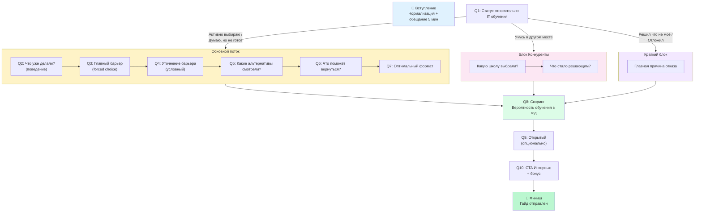

# Финальный План Опроса v3 — Kata Academy

**Дата:** 20 января 2026
**Версия:** 3.0 (полная переработка)
**Основа:** Круглый Стол с 5 экспертами (Head of Marketing, CRM Lead, Sales Director, Senior Researcher, Senior Sociologist)

---

## 📋 Общая Информация

| Параметр | Значение |
|----------|----------|
| **Тип исследования** | Количественный онлайн-опрос |
| **Цель** | Скоринг аудитории + понимание барьеров и триггеров |
| **НЕ цель** | Продажа или глубинное исследование (это для интервью) |
| **Количество вопросов** | 10 основных + 1 опциональный |
| **Время прохождения** | 5 минут |
| **Целевой Completion Rate** | 65-75% |
| **Целевая конверсия в интервью** | 12-18% |
| **Аудитория** | Лиды из базы, не совершившие покупку |

---

## 🎁 Лид-Магниты

### За прохождение опроса:
**«Как получить первый оффер в IT»**
- Практический гайд
- Отправляется автоматически после завершения

### За участие в интервью:
**«ТОП-10 языков программирования 2026»**
- Аналитика: зарплаты, вакансии, перспективы
- Отправляется после проведения созвона

---

## 🗺 Карта Опроса (Логика Ветвления)



---

## 📊 ОПРОСНИК v3

---

### 📝 ВСТУПЛЕНИЕ

> **Привет! 👋**
>
> Мы хотим понять, как сделать обучение IT лучше.
> 
> Это займёт **5 минут**. Нет правильных или неправильных ответов — нам важен ваш честный опыт.
>
> 🎁 В конце — гайд **«Как получить первый оффер в IT»** в подарок.

---

### Q1. Какой у вас сейчас статус относительно обучения IT?
*Тип: Одиночный выбор*

> *Многие люди в разное время думают о переходе в IT. Какой вариант лучше описывает вашу ситуацию сейчас?*

- [ ] Активно выбираю курс — планирую начать в ближайшие месяцы
- [ ] Думаю об этом, но пока не готов начать
- [ ] Уже начал учиться в другом месте
- [ ] Решил, что IT — не для меня
- [ ] Отложил на неопределённый срок

> **Логика ветвления:**
> - Варианты 1-2 → Основной поток (Q2-Q7)
> - Вариант 3 → Блок "Конкуренты"
> - Варианты 4-5 → Краткий блок

---

### Q2. Что вы уже делали в направлении обучения IT?
*Тип: Множественный выбор*
*(Показывается для вариантов 1-2 в Q1)*

> *Отметьте всё, что уже пробовали:*

- [ ] Смотрел бесплатные видео/уроки (YouTube, Coursera и т.д.)
- [ ] Читал статьи о переходе в IT
- [ ] Сравнивал разные школы и курсы
- [ ] Общался с людьми, которые уже перешли в IT
- [ ] Пробовал писать код самостоятельно
- [ ] Проходил бесплатные вебинары или пробные уроки школ
- [ ] Ничего из перечисленного

---

### Q3. Что в первую очередь остановило вас от начала обучения?
*Тип: Одиночный выбор (forced choice)*
*(Показывается для вариантов 1-2 в Q1)*

> *Выберите ОДНО — то, что повлияло сильнее всего:*

- [ ] **Стоимость** — пока не готов к таким расходам
- [ ] **Время** — не уверен, что смогу совмещать с работой/семьёй
- [ ] **Сомнения** — не уверен, что это подходит мне
- [ ] **Качество** — не нашёл курс, которому доверяю
- [ ] **Рынок** — боюсь, что сейчас сложно найти работу джуну
- [ ] Другое: _________

---

### Q4. [УСЛОВНЫЙ] Уточните, пожалуйста
*Тип: Зависит от Q3*

#### Если выбрано "Стоимость":
> *Что ближе к вашей ситуации?*

- [ ] Деньги есть, но не уверен, что стоит вкладывать
- [ ] Сейчас нет нужной суммы, планирую накопить
- [ ] Рассмотрел бы с рассрочкой (ежемесячный платёж)
- [ ] Готов платить только после результата (трудоустройства)

#### Если выбрано "Время":
> *Сколько часов в неделю вы реально могли бы выделить?*

- [ ] Менее 5 часов
- [ ] 5-10 часов
- [ ] 10-15 часов
- [ ] Более 15 часов

#### Если выбрано "Сомнения":
> *Что вызывает сомнения? (можно несколько)*

- [ ] Не уверен, что есть способности к программированию
- [ ] Не понимаю, какое направление мне подходит
- [ ] Думаю, что возраст может мешать трудоустройству
- [ ] Не уверен, что смогу довести до конца

#### Если выбрано "Качество" или "Рынок":
> *Что могло бы изменить ваше мнение?*

- [ ] Гарантия трудоустройства или возврата денег
- [ ] Статистика трудоустройства выпускников
- [ ] Отзывы на независимых платформах
- [ ] Пробный доступ к курсу

---

### Q5. Рассматривали ли вы другие школы?
*Тип: Множественный выбор*

- [ ] Skillbox
- [ ] GeekBrains
- [ ] Яндекс Практикум
- [ ] Нетология
- [ ] Skypro
- [ ] Hexlet
- [ ] Другие курсы: _________
- [ ] Самостоятельное обучение (бесплатно)
- [ ] Не рассматривал альтернативы

---

### Q5-ALT. [ДЛЯ КОНКУРЕНТОВ] Вы выбрали другую школу. Какую и почему?
*Тип: Два подвопроса*
*(Показывается если в Q1 выбрано "Уже учусь в другом месте")*

**5a. Какую школу выбрали?**
- [ ] Skillbox
- [ ] GeekBrains
- [ ] Яндекс Практикум
- [ ] Нетология
- [ ] Skypro
- [ ] Другое: _________

**5b. Что стало решающим? (макс. 2)**
- [ ] Более низкая цена
- [ ] Удобные условия оплаты
- [ ] Лучшие отзывы
- [ ] Рекомендация знакомых
- [ ] Сильнее гарантия трудоустройства
- [ ] Известность бренда
- [ ] Понравился пробный контент

---

### Q6. Что помогло бы вам вернуться к идее обучения?
*Тип: Множественный выбор (макс. 2)*

> *Многие люди откладывают обучение и потом возвращаются. Что могло бы повлиять на ваше решение?*

- [ ] Гарантия возврата денег, если не найду работу
- [ ] Возможность попробовать бесплатно перед оплатой
- [ ] Более гибкий формат (учёба в своём темпе)
- [ ] Снижение стоимости или акция
- [ ] Разговор с реальным выпускником курса
- [ ] Изменение жизненной ситуации (больше времени/денег)
- [ ] Ничего — я окончательно отказался от идеи

---

### Q7. Какой формат был бы для вас оптимальным?
*Тип: Два подвопроса*

**7a. Формат обучения:**
- [ ] Интенсив (5+ часов в день, быстрый результат)
- [ ] Part-time (2-3 часа в день, совмещать с работой)
- [ ] Выходного дня (суббота-воскресенье)
- [ ] Полностью в своём темпе (без расписания)

**7b. Формат оплаты:**
- [ ] Полная оплата сразу (максимальная скидка)
- [ ] Рассрочка на 6-12 месяцев
- [ ] Оплата после трудоустройства (% от зарплаты)

---

### Q8. Насколько вероятно, что вы начнёте обучение IT в ближайший год?
*Тип: Одиночный выбор*

- [ ] Очень вероятно — жду подходящий момент
- [ ] Скорее да — если сложатся условия
- [ ] Возможно — ещё не решил
- [ ] Скорее нет — маловероятно
- [ ] Точно нет — это не для меня

> **Скоринг для CRM:**
> | Ответ | Сегмент | Действие |
> |-------|---------|----------|
> | Очень/Скорее да | 🔥 Hot | Priority nurturing, персональный follow-up |
> | Возможно | 🟡 Warm | Content drip, soft reminders |
> | Скорее/Точно нет | ❄️ Cold | Архив, не тратим ресурсы |

---

### Q9. Есть ли что-то важное, что мы не спросили?
*Тип: Открытый (опционально)*

> *Если хотите добавить — напишите. Если нет — просто пропустите.*

```
[Текстовое поле — 300 символов]
```

---

### Q10. Готовы поделиться опытом в коротком разговоре?
*Тип: Одиночный выбор*

> Мы хотим лучше понять потребности людей, думающих о переходе в IT. 
> Это займёт **не более 10 минут**. Мы ничего не продаём — только слушаем.
>
> 🎁 **В благодарность:** гайд «ТОП-10 языков программирования 2026» — с аналитикой по зарплатам и вакансиям.

- [ ] **Да, свяжитесь со мной**
  - Telegram / WhatsApp / Телефон: _________
  - Удобное время: _________
- [ ] Нет, спасибо — только опрос

---

### 🎁 ФИНАЛЬНЫЙ ЭКРАН

> 🎉 **Спасибо за ваши ответы!**
>
> Ваш гайд **«Как получить первый оффер в IT»** уже отправлен на почту.
>
> Ваше мнение поможет сделать обучение лучше для тысяч людей. 💙

---

## 🛠 Технические Рекомендации

### Платформа
- **Рекомендуется:** Typeform (лучший UX, условная логика)
- **Альтернатива:** Tally (бесплатный, хорошая логика)

### Настройки
- [x] Progress bar включен
- [x] Randomization для Q5 (конкуренты)
- [x] Mobile-first
- [x] Автосохранение
- [x] Автоотправка гайда после завершения

### Рассылка
- **Время:** 10:00-12:00
- **Дни:** Вторник-Четверг
- **Reminder:** через 3 дня
- **Subject A/B:**
  - A: "5 минут = гайд по первому офферу в IT"
  - B: "Помогите сделать обучение IT лучше (5 мин)"

---

## 📈 Метрики Успеха

| Метрика | Цель | Критический минимум |
|---------|------|---------------------|
| Completion Rate | >70% | >55% |
| Конверсия в интервью | 15% | 10% |
| Avg. Time | 5 мин | <7 мин |
| Quality Score Q9 | >30% заполнивших | >20% |

---

## ✅ Чек-лист Перед Запуском

- [ ] Гайд "Первый оффер" готов и загружен
- [ ] Гайд "ТОП-10 языков" готов
- [ ] Опрос создан на платформе
- [ ] Условная логика (Q4) протестирована
- [ ] Интеграция с email для автоотправки
- [ ] Интеграция с CRM для скоринга
- [ ] **Пилот на 30-50 респондентах**
- [ ] Анализ пилота
- [ ] Массовый запуск

---

**Документ создан на основе:** [Survey_Roundtable_v3.md](file:///c:/Code/ai-first-workspace-template-main/Docs/Marketing_Roundtable/Research/Survey_Roundtable_v3.md)
