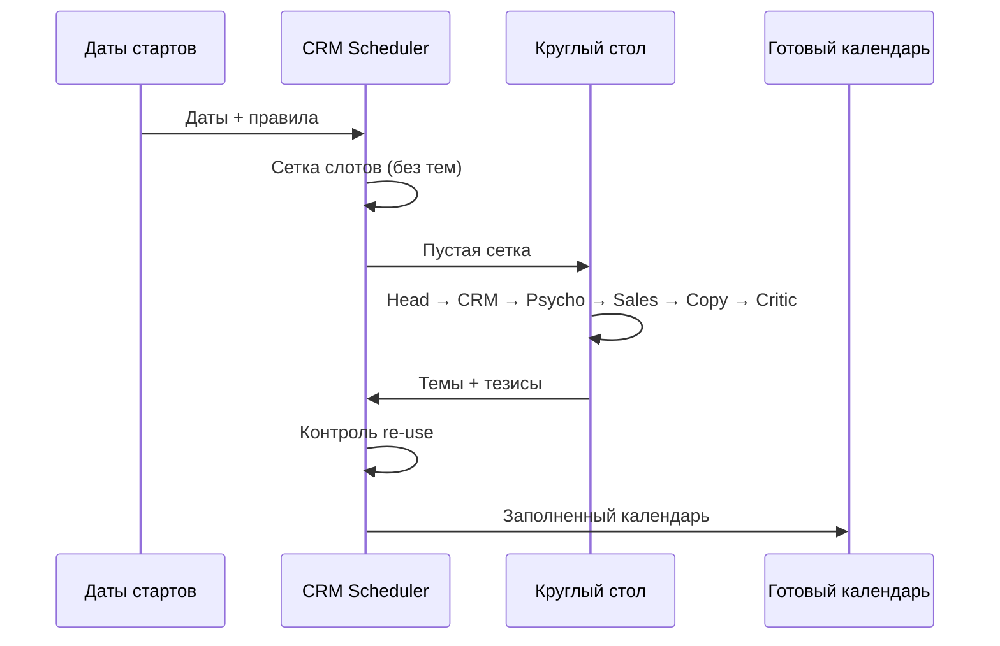

# Workflow: Формирование Email-календаря

**Описание:** Полный процесс создания email-календаря через Marketing Roundtable.

---

## Участники процесса

| Агент | Роль |
|:------|:-----|
| **CRM Scheduler** 📅 | Формирует сетку слотов, контролирует re-use |
| **Head of Marketing** | Задаёт цели месяца |
| **CRM Lead** | Определяет сегменты и приоритеты |
| **Behavioral Psychologist** | Добавляет триггеры, снимает барьеры |
| **Sales Director** | Проверяет воронку и конверсию |
| **Senior Copywriter** | Формирует темы и тезисы |
| **Marketing Critic** | Финальная проверка |

---

## Этапы workflow

### Этап 1: Сетка слотов (CRM Scheduler)

**Входные данные:**
- Даты стартов курсов
- Сегменты: Java, 1C, Frontend, QA, Go, ⚪ Без направления

**Что делает CRM Scheduler:**
1. Создаёт пустую таблицу на месяц
2. Размечает warmup-серии (5 писем за 2 недели до старта)
3. Считает оставшиеся слоты по правилу 3 письма/неделю
4. **НЕ назначает темы** — только слоты

---

### Этап 2: Круглый стол (генерация контента)

**Участники:**
Head of Marketing → CRM Lead → Psychologist → Sales → Copywriter → Critic

**Результат:**
- Темы писем
- Ключевые тезисы
- Развёрнутые тезисы
- Примеры структуры

---

### Этап 3: Контроль Re-use (CRM Scheduler)

**CRM Scheduler возвращается** и проверяет:
1. Универсальные темы → ставит во все сегменты в один день
2. Уникальные темы → только в своё направление
3. Не плодить темы — если подходит нескольким, одно письмо на всех

---

## Визуализация процесса

---

## ПРАВИЛА ФОРМИРОВАНИЯ КАЛЕНДАРЯ

### 📊 Количество и частота

| Правило | Описание |
|:--------|:---------|
| **3 письма в неделю** | На каждый сегмент — ровно 3 письма |
| **Warmup = приоритет** | Сначала ставим warmup, потом общие |
| **Дайджест — 1 раз в месяц** | В конце месяца, не чаще |

---

### 🚫 Запреты

| Запрет | Причина |
|:-------|:--------|
| **Истории выпускников — НЕ ДЕЛАЕМ** | Запрещено |
| **Несколько дайджестов — НЕТ** | Только 1 в месяц |
| **Дублирование тем — НЕТ** | Используем re-use |
| **Термин ISA — НЕ ИСПОЛЬЗОВАТЬ** | Писать «Гибридная модель оплаты» |
| **Конкретные суммы предоплаты — НЕТ** | У разных направлений разные суммы |
| **«Не готов платить — начни с гибрида» — НЕТ** | Платить придётся в любом случае |
| **Формулировка «Личный ментор» — НЕТ** | Писать просто «Ментор» |

---

### ✅ Обязательные правила контента

| Правило | Описание |
|:--------|:---------|
| **Срок программы: 6-9 месяцев** | Не короче! Не писать 5 или 11 месяцев |
| **Сравнение направлений = ВСЕ направления** | Java, Frontend, QA, Go, 1C — всегда все пять |
| **Гибридная модель оплаты** | Не ISA, не «гибрид» — полное название |
| **Подробности про оплату — на консультации** | Не указывать конкретные суммы |
| **НЕ использовать тег [Имя]** | Не персонализируем в теле письма |
| **Одна дата старта в письме** | Если две даты — указываем БЛИЖАЙШУЮ |
| **Нет markdown в тексте** | Текст должен быть чистым для копирования |
| **Только Тема и Прехедер** | Остальные метаданные (сегменты, CTA) убрать |
| **Формат шапки** | Тема: ... \n Прехедер: ... |

### 📅 Warmup-серия (прогрев к старту)

| Письмо | Дней до старта | Тип |
|:-------|:--------------:|:----|
| Welcome | -14 | Уникальное |
| Рынок | -11 | Уникальное (цифры) |
| Мифы | -7 | Универсальное* |
| Методика | -4 | Универсальное* |
| Дедлайн | -3 | Уникальное |

> *Мифы и Методика можно использовать как универсальные, если текст не привязан к цифрам направления

---

### 🔄 Re-use (переиспользование)

**Универсальные темы (для ВСЕХ сегментов):**
- «Я гуманитарий, у меня не получится»
- «Нужен английский»
- «Почему самоучки бросают» (Методика)
- Гарантия трудоустройства
- Как совмещать с работой
- Модель оплаты (Гибридная vs Предоплата)
- IT-тренды
- FOMO («почему откладывать плохо»)

**Уникальные темы (только своё направление):**
- Welcome (специфика курса)
- Рынок (цифры ЗП по направлению)
- Дедлайн (дата старта)

**Правило:** Универсальные письма отправляем **в один день** для всех сегментов = одна работа.

---

### ⚪ Сегмент «Без направления»

| Правило | Описание |
|:--------|:---------|
| **3 письма в неделю** | Как и другие сегменты |
| **Только общие темы** | Нет warmup (нет старта) |
| **Профориентация обязательна** | В начале месяца |

---

### 📝 Типы общих писем

| Тип | Частота | Описание |
|:----|:--------|:---------|
| Профориентация | 1 раз/мес | Выбор направления |
| Дайджест | 1 раз/мес | Итоги месяца, старты |
| Миф | 2-3 раза/мес | Снятие барьеров |
| Гарантия | 1 раз/мес | Объяснение модели |
| FOMO | 1-2 раза/мес | Логическая срочность |
| Праздники | По ситуации | 23 февраля, 8 марта и др. |

---

### 📁 Нейминг файлов

| Тип файла | Формат названия | Пример |
|:----------|:----------------|:-------|
| Календарь месяца | `Calendar_[Месяц]_[Год].md` | `Calendar_February_2026.md` |
| Warmup направления | `Warmup_[Направление]_[Месяц]_[Год].md` | `Warmup_Java_February_2026.md` |
| Общие письма | `General_Emails_[Месяц]_[Год].md` | `General_Emails_February_2026.md` |
| Матрица re-use | `Reuse_Matrix_[Месяц]_[Год].md` | `Reuse_Matrix_February_2026.md` |

---

## Чек-лист для CRM Scheduler

- [ ] Получены даты стартов
- [ ] Размечены warmup-серии для каждого направления
- [ ] Посчитаны оставшиеся слоты (3/неделю минус warmup)
- [ ] Круглый стол сгенерировал темы
- [ ] Универсальные темы расставлены в один день для всех
- [ ] Уникальные темы — только в своё направление
- [ ] Проверено: нет дублирования тем
- [ ] Проверено: 1 дайджест в месяц
- [ ] Проверено: нет историй выпускников
- [ ] Файл назван по формату `Calendar_[Месяц]_[Год].md`
