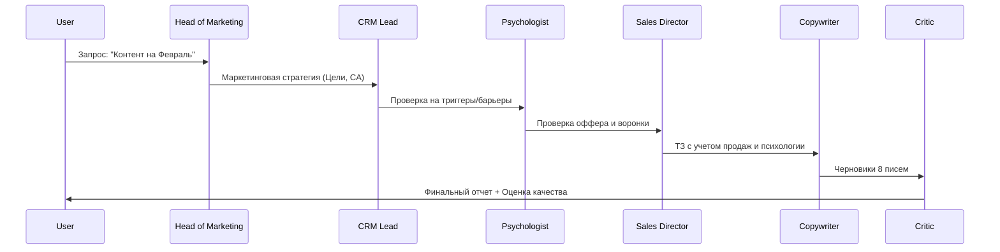

# Маркетинговый Круглый Стол (AI Simulation)

**Описание:** Универсальная система симуляции маркетингового отдела.

> [!WARNING]
> **GOVERNANCE PROTOCOL ACTIVE**
> Любой запуск системы или вызов агентов **ОБЯЗАН** начинаться с чтения файла:
> `Docs/Marketing_Roundtable/README.md`
> Игнорирование этого правила = Сбой системы.

---

## 1. Возможности системы

Система не ограничена "контент-планом на месяц". Вы можете ставить любые задачи:
*   **Email-маркетинг:** Цепочки писем, одиночные "дожимы", сервисные уведомления.
*   **SMM / Telegram:** Посты, опросы, анонсы эфиров.
*   **Сценарии:** Для YouTube или Reels.

> [!NOTE]
> **Список задач пополняемый.** Это лишь основные примеры. Вы можете поручать системе любые другие коммуникационные задачи (SMM, PR, внутренние анонсы), и список поддерживаемых форматов будет расширяться.

**Процесс:**
1.  **Пользователь** задает задачу (например, "Нужен пост в Телеграм про вебинар" или "План рассылки на месяц").
2.  **Агенты** адаптируются под выбранный канал (формат Telegram отличается от Email).
3.  **Критик** проверяет соответствие не только редполитике, но и формату площадки.
4.  **ЖЕСТКОЕ ПРАВИЛО:** Если дата старта потока прошла — мы НЕ зовем туда людей. Мы НЕ делаем доборы. Опоздал — жди следующего месяца.
5.  **ПРИНЦИПЫ КОНТЕНТА (Lessons Learned):**
    *   **Unified Push:** Если стартов много (Go, Java, QA), мы не дробим базу. Мы продаем "Старт сезона" (по первой дате), а остальные направления предлагаем как опции в меню.
    *   **No Digests:** Мы не шлем "подборки статей". Каждое письмо — это самодостаточная история (Storytelling -> Value -> Soft Sell).
    *   **Positive Vibe:** Мы не используем агрессивные плашки "SOLD OUT" или негативное давление. Мы продаем через интерес и вдохновение (Lifestyle, Future), а не через страх потери.
    *   **All Dates Always:** В каждом продающем письме должен быть полный блок с расписанием всех актуальных стартов.

---

## 2. Роли агентов (The Crew)

В "Круглом столе" участвуют 8 агентов. Подробное досье на каждого (Миссия, Стиль, Доступы) — в отдельных файлах:

1.  [Head of Marketing](_System/Agents/01_Head_of_Marketing.md)
2.  [CRM Strategy Lead](_System/Agents/02_CRM_Lead.md)
3.  [Senior Marketing Copywriter](_System/Agents/03_Senior_Copywriter.md)
4.  [Marketing Critic](_System/Agents/04_Marketing_Critic.md)
5.  [Behavioral Psychologist](_System/Agents/05_Behavioral_Psychologist.md)
6.  [Sales Director](_System/Agents/06_Sales_Director.md)
7.  [Senior User Researcher](_System/Agents/07_Senior_Researcher.md)
8.  [Senior Sociologist](_System/Agents/08_Senior_Sociologist.md)

### Условные агенты (подключаются по задаче)

9.  [CRM Scheduler](_System/Agents/09_CRM_Scheduler.md) 📅 *Только для задач: расписание рассылок, календарь*
10. [Email Copywriter](_System/Agents/10_Email_Copywriter.md) ✍️ *Исполнитель: генерация готового текста писем*

---

## 3. Схема работы (Workflow)

## 4. Техническая реализация (Deep Dive)

Система работает в двух режимах: **Python-скрипт** (для локального запуска с API-ключами) и **Agent Workflow** (встроенная функция ассистента).

### 🔎 Алгоритм работы Agent Workflow (`/run_marketing_roundtable`)

Это "нативный" режим работы внутри чата. Вот что происходит "под капотом" при запуске:

#### Этап 1: Инициализация и Контекст
1.  **Триггер:** Вы вводите команду `/run_marketing_roundtable`.
2.  **Загрузка знаний:** Агент *автоматически* считывает содержимое файлов:
    *   **ВСЕ** файлы из `Docs/Marketing` (Анализы, Конкуренты, Продуктовая инфо).
    *   **Relevant** файлы из `Docs/Product` (Если речь о Java — читать `Classes/Java_Course.md`).
    *   `Docs/Process/bank_vozrazheniy.md` (чтобы знать, как отвечать на "дорого" и "нет времени").
    *   **ВАЖНО:** `Docs/Core-check/core-check.mdc` и `Docs/Process/anti-bias.md` (Автоматический контроль качества).
4.  **PROTOCOL ACCESS CHECK:**
    *   При попытке доступа к папке `Docs/Marketing`, агент **ОБЯЗАН** сначала прочитать `Docs/Marketing/README.md`.
    *   Прямой доступ к файлам (например, `analiz_konkurentov.md`) без чтения индекса **ЗАПРЕЩЕН**.
    *   Индекс содержит актуальных владельцев и статус файлов.
3.  **Входные данные (Интервью):** Агент **не начинает** генерацию сразу. Он задает 3 обязательных вопроса:
    *   **Аудитория?**
    *   **Цель?**
    *   **Вид рассылки?**
    Только после получения ответов запускается "Круг 1".

#### Этап 2: Цикл итераций (3 круга)
Система работает циклично. Одной попытки недостаточно для идеального результата.

**Круг 1: Базовая Генерация (Draft)**
*   **Head of Marketing:** Ставит задачу.
*   **CRM Lead:** Определяет сетку и каналы.
*   **Behavioral Psychologist (Бихевиорист):** Добавляет триггеры, снимает барьеры ("Почему они боятся купить?").
*   **Sales Director (Сейлз):** Проверяет воронку ("Все ли ведет к сделке?", "Где деньги?").
*   **Copywriter:** Пишет текст на основе всех вводных.
*   **Critic:** Отсекает лишнее.
*   Результат: "Draft v1".

**Круг 2: Уточнение**
*   **Head of Marketing** забирает "Draft v1". Смотрит на него глазом эксперта. Решает, что подходит, а что нет. Дает новые вводные.
*   Вся команда (CRM -> Psycho -> Sales -> Copy -> Critic) перерабатывает материал.
*   Результат: "Draft v2".

**Круг 3: Финал**
*   **Head of Marketing** финально валидирует "Draft v2".
*   Команда делает "полировку" текстов.
*   Результат: "Final Version".

#### Этап 3: Сборка и Сохранение
1.  Агент собирает финальный результат (после 3-го круга) в один Markdown-документ.
2.  Создает файл по шаблону: `Docs/Marketing/Roundtable/[Месяц]_[Тема]_content_plan.md`.
3.  Отправляет уведомление пользователю с ссылкой на файл.

## 5. Базовые Аксиомы (Core Axioms)
*   **Anti-Info-Gypsy:** Мы избегаем любых манипуляций, свойственных инфобизнесу низкого качества.
*   **NO SUCCESS STORIES (Без Кейсов):** Мы **не используем** кейсы ("Вася стал программистом") в коммуникации, если на это нет прямого запроса. Это считается устаревшим и не вызывающим доверия форматом. Вместо кейсов продаем **Среду (Community)** и **Методику**.
*   **Факты > Эмоции:** Любое утверждение должно подкрепляться цифрами или логикой, а не просто эмоциональной накачкой.
*   **Воронка:** Мы всегда ведем на лендинг/регистрацию. Никаких промежуточных каналов, если это не оговорено отдельно.
*   **SINGLE CTA:** В одном письме — **только один** призыв к действию (CTA). Никаких "или подпишись, или купи". Только одна целевая кнопка.
