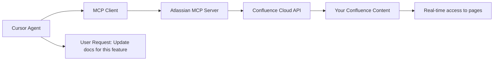

# Стратегия Документации Confluence-GitHub Шаблон
*[ПРИМЕР ШАБЛОНА - Оценка опций для работы с контентом Confluence в рабочих процессах разработки на основе исследований]*

## Обзор
Этот шаблон предоставляет сравнение подходов для интеграции документации Confluence с рабочими процессами разработки на основе исследований, особенно для работы с AI ассистентами кодирования, такими как Cursor.

## 🎯 Цели
1. **Включить AI-powered разработку**: Работать с документами Confluence напрямую в Cursor/VS Code с помощью AI
2. **Поддерживать единый источник истины**: Избегать конфликтов синхронизации и проблем дублирования данных
3. **Минимизировать накладные расходы на обслуживание**: Выбирать решения, не требующие постоянного ухода
4. **Использовать существующие инструменты**: Строить на проверенных технологиях, а не на кастомных решениях

## 📊 Результаты Исследования: Проверка Реальности Решений Синхронизации

### Реальный Опыт Пользователей (2024)
На основе исследования сообщества и отчетов пользователей:

**❌ Традиционные Подходы Синхронизации - Основные Проблемы:**
- "Мы нашли несколько open source проектов GitHub, но все они не поддерживаются" - пользователь Atlassian Community
- Множество пользователей сообщают, что решения синхронизации часто ломаются
- Конфликты версий между Confluence и Git становятся неуправляемыми
- Кастомные скрипты требуют постоянного обслуживания при изменении API
- Проблемы производительности с большими наборами документации

**📈 Надежность Сервиса Confluence (2024):**
- 132 инцидента, затрагивающих сервисы Jira/Confluence
- Более 2,100+ часов перебоев в обслуживании в 2024
- Регулярные изменения API, ломающие кастомные интеграции

**🔍 Результаты Оценки Инструментов:**

| Подход | Рейтинг Пользователей | Обслуживание | Надежность | Лучше Для |
|----------|-------------|-------------|-------------|------------|
| Ручной Экспорт/Импорт | 2/5 | Высокое | Низкая | Одноразовая миграция |
| Git for Confluence | 3/5 | Среднее | Средняя | Встраивание GitHub в Confluence |
| Кастомные Python Скрипты | 2/5 | Очень Высокое | Низкая | Устарело |
| GitHub-to-Confluence Publishers | 3/5 | Среднее | Средняя | Только односторонняя синхронизация |
| **MCP Интеграция** | **5/5** | **Низкое** | **Высокая** | **AI-powered рабочие процессы** |

## ⭐ Рекомендуемый Подход: Model Context Protocol (MCP)

### Почему MCP - Прорыв

**🆕 Официальный Atlassian MCP Сервер (2024)**
- Atlassian выпустил официальный Remote MCP Server для Jira и Confluence
- Прямой доступ к контенту Confluence через AI агентов
- Синхронизация не требуется - поддерживается единый источник истины
- OAuth аутентификация с правильными границами разрешений

**✅ Ключевые Преимущества:**
1. **Нет Конфликтов Версий**: Прямой доступ устраняет проблемы синхронизации
2. **Низкое Обслуживание**: Официальная поддержка от Atlassian
3. **AI-Native**: Разработан специально для рабочих процессов AI агентов
4. **Безопасность**: OAuth 2.0 аутентификация с контролем разрешений
5. **Реальное Время**: Всегда актуальный доступ к контенту

### Как MCP Работает с Cursor



### Опции Внедрения MCP

#### 1. Официальный Atlassian MCP Сервер ⭐ Рекомендуется
```bash
# Настройка в Claude Desktop или Cursor
{
  "atlassian-mcp": {
    "command": "npx",
    "args": ["@atlassian/mcp-server"],
    "env": {
      "CONFLUENCE_URL": "https://yourcompany.atlassian.net",
      "CONFLUENCE_EMAIL": "your-email@company.com"
    }
  }
}
```

**Возможности:**
- Поиск страниц и пространств Confluence
- Чтение содержимого страниц с правильным форматированием
- Создание и обновление страниц
- Соблюдение всех разрешений Confluence
- Многошаговые операции (создание задач И связывание с документами)

#### 2. Кастомный MCP Сервер (Продвинутый)
Для специализированных рабочих процессов, создайте кастомный MCP сервер:

```python
# Пример структуры MCP сервера
from fastmcp import FastMCP
from atlassian import Confluence

mcp = FastMCP("Custom Confluence MCP")

@mcp.tool()
def search_confluence_docs(query: str, space_key: str = None):
    """Поиск Confluence с фильтрами, специфичными для вашего рабочего процесса"""
    # Ваша кастомная логика здесь
    pass

@mcp.prompt()
def create_technical_spec(feature_name: str):
    """Шаблон для создания технических спецификаций"""
    return f"""Создать техническую спецификацию для {feature_name}...."""
```

## 🔄 Альтернативные Подходы (Не Рекомендуются)

### 1. Традиционные Решения Синхронизации
**Статус**: Кошмар обслуживания на основе отчетов пользователей 2024

- **Git for Confluence**: Хорош для встраивания, плох для полной синхронизации
- **GitHub-to-Confluence Publisher**: Только односторонний, часто ломается
- **Кастомные Скрипты**: Высокое обслуживание, изменения API их ломают
- **Zapier/Tray.ai**: Ограниченная функциональность, дорого для enterprise

### 2. Ручной Экспорт/Импорт
**Статус**: Только для одноразовых миграций

- Экспорт пространств Confluence в Markdown
- Ручное обслуживание в GitHub
- Теряет все специфичные для Confluence функции
- Нет двунаправленных обновлений

## 🚀 Руководство по Внедрению

### Фаза 1: Оценка (Неделя 1)
1. **Тестирование Atlassian MCP Сервера**
   ```bash
   # Установить Claude Desktop от Anthropic
   # Настроить Atlassian MCP сервер
   # Протестировать с примером контента Confluence
   ```

2. **Оценка Текущей Документации**
   - Аудит критических пространств Confluence
   - Идентификация наиболее используемого контента
   - Картирование пользовательских рабочих процессов и требований

### Фаза 2: Настройка MCP (Неделя 2)
1. **Конфигурация OAuth**
   - Настройка API токенов Atlassian
   - Конфигурация OAuth 2.0 потока
   - Тестирование границ разрешений

2. **Интеграция Cursor/Claude**
   - Установка MCP сервера
   - Конфигурация клиентских приложений
   - Обучение команды новым рабочим процессам

### Фаза 3: Оптимизация Рабочего Процесса (Постоянно)
1. **Кастомные Промпты**
   - Создание шаблонов для общих типов документов
   - Настройка автоматизированных рабочих процессов
   - Создание специфичных для команды ярлыков

2. **Мониторинг и Обслуживание**
   - Отслеживание использования и производительности
   - Мониторинг изменений API
   - Сбор обратной связи от команды

## 📋 Матрица Решений

Используйте эту матрицу для оценки подходов для вашей организации:

| Критерий | Вес | MCP | Решения Синхронизации | Ручной |
|----------|--------|-----|----------------|--------|
| **Усилия на Обслуживание** | 25% | 9/10 | 3/10 | 2/10 |
| **Надежность** | 20% | 9/10 | 4/10 | 5/10 |
| **AI Интеграция** | 20% | 10/10 | 2/10 | 1/10 |
| **Обновления в Реальном Времени** | 15% | 10/10 | 5/10 | 1/10 |
| **Безопасность** | 10% | 9/10 | 6/10 | 8/10 |
| **Сложность Настройки** | 10% | 7/10 | 4/10 | 9/10 |
| **Общий Счет** | | **9.1/10** | **3.8/10** | **3.1/10** |

## 🔒 Соображения Безопасности

### Лучшие Практики Безопасности MCP
1. **Контроль Разрешений**: Соблюдение существующих разрешений Confluence
2. **OAuth Токены**: Регулярная ротация, ограничение области
3. **Логирование Аудита**: Отслеживание всех изменений, сгенерированных AI
4. **Проверка Контента**: Внедрение рабочих процессов одобрения для контента, созданного AI

### Конфиденциальность Данных
- AI агенты получают доступ только к явно разрешенному контенту
- Данные не хранятся вне Confluence
- Полный аудит-трейл всех взаимодействий

## 📚 Дополнительные Ресурсы

### Официальная Документация
- [Документация Atlassian MCP Сервера](https://www.atlassian.com/blog/announcements/remote-mcp-server)
- [Спецификация Model Context Protocol](https://spec.modelcontextprotocol.io/)
- [Введение в MCP от Anthropic](https://www.anthropic.com/news/model-context-protocol)

### Ресурсы Сообщества
- [Коллекция MCP Серверов](https://cursor.directory/mcp)
- [FastMCP Python Framework](https://github.com/jlowin/fastmcp)
- [Примеры и Шаблоны MCP](https://github.com/modelcontextprotocol)

### Руководства по Миграции
- [Документация Confluence REST API](https://developer.atlassian.com/cloud/confluence/rest/v1/)
- [Настройка OAuth 2.0 для Atlassian](https://developer.atlassian.com/cloud/confluence/oauth-2-3lo-apps/)

---

## 📊 Метрики Успеха

### Измерение Успеха Внедрения
- **Продуктивность Разработчиков**: Время на поиск/обновление документации
- **Свежесть Контента**: Средний возраст документации
- **Принятие AI**: Процент документов, затронутых AI помощью
- **Снижение Ошибок**: Меньше конфликтов синхронизации и битых ссылок
- **Удовлетворенность Команды**: Результаты опроса по новому рабочему процессу

### Ключевые Показатели Эффективности
```yaml
target_metrics:
  doc_search_time: "< 30 секунд"
  content_update_frequency: "Еженедельно для активных проектов"
  ai_assistance_usage: "> 80% команды"
  sync_conflict_rate: "0% (устранено с MCP)"
  system_uptime: "> 99% (используя инфраструктуру Atlassian)"
```

---

*Последнее Обновление: На основе исследований и опыта пользователей 2024*
*Статус: Шаблон для организаций, оценивающих рабочие процессы документации*
*Рекомендация: Начните с оценки MCP - это явный победитель для AI-powered разработки*